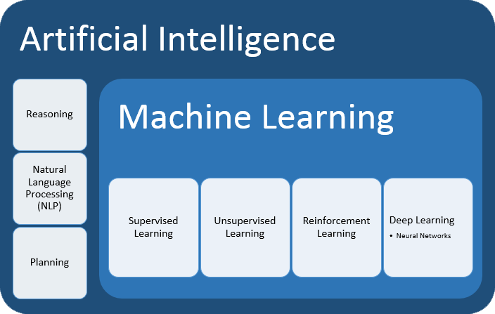

[BACK](./)

The 11 groups algorithms: Regression, Classification, Clustering, Association Rule Learning, Reinforcement Learning, Natural Language Processing, Deep Learning,  Dimensionality Reduction, Boosting, Anomaly Detection, Regularization. 

## I. Regression

1. Simple Linear Regression
1. Multiple Linear Regression
1. Polynomial Regression
1. Support Vector Regression
1. Decision Tree Regression
1. Random Forest Regression
1. Ridge Regression (L2)
1. Lasso Regression (Least absoulute selection and shrinkage operator)
1. Neural Network Regression
1. Gradient Descent Regression
1. Principal Component Regression (PCR)
1. Poisson Regression
1. Ordinary Least Squares (OLS) Regression
1. Ordinal Regression
1. Stepwise Regression
1. Elastic Net Regression
1. Bayesian Linear Regression
1. Least-Angled Regression (LARS)
1. Locally Estimated Scatterplot Smoothing (LOESS)
1. Multivariate Adaptive Regression Splines (MARS)
1. Locally Weighted Regression (LWL)
1. Quantile Regression
1. Partial Least Squares Regression
1. K Nearest Neighbours (KNN) Regression
1. Stochastic Gradient Descent (SGD) Regression
1. Bagging (Bootstrap Aggregation) Regression
1. Extremely Randomized Trees Regression
1. Gradient Boosting Regression
1. AdaBoost Regression
1. Boosted Decision Tree Regression

## II. Classification

1. Logistic Regression
1. K Nearest Neighbours (KNN) Classification
1. Support Vector Machine (SVM)
1. Kernel SVM
1. Naive Bayes
1. Decision Tree Classification
1. Random Forest Classification
1. Neural Network Classification
1. Gaussian Naive Bayes
1. Bernoulli Naive Bayes
1. Multinomial Naive Bayes
1. Linear Support Vector Classifier (SVC)
1. Stochastic Gradient Descent (SGD) Classification
1. Bayesian Network
1. Linear Discriminant Analysis (LDA)
1. Quadratic Discriminant Analysis (QDA)
1. Fisher's Linear Discriminant
1. Decision Stump
1. NuSVC
1. Zero Rule (ZeroR)
1. One Rule (OneR)
1. Bagging (Bootstrap Aggregation) Classification
1. Extremely Randomized Trees Classification
1. Gradient Boosting Classification
1. AdaBoost Classification
1. Boosted Decision Tree Classification

## III. Clustering

1. K-Means Clustering
1. Hierarchical Clustering
1. K-Medians Clustering
1. K-Modes Clustering
1. Mean Shift Clustering
1. Fuzzy K-Modes
1. Fuzzy C-Means
1. Mini Batch K-Means Clustering
1. Expectation Maximization
1. DBSCAN
1. Minimum Spanning Trees
1. Quality Threshold
1. Gaussian Mixture Model (GMM)
1. Spectral Clustering

## IV. Association Rule Learning

1. Apriori
1. Eclat
1. FP-Growth

## V. Reinforcement Learning

1. Upper Confidence Bound
1. Thompson Sampling

## VI. Natural Language Processing

1. Bag of Words

## VII. Deep Learning (Neural Networks)

1. Artificial Neural Networks
1. Convolutional Neural Network (CNN)
1. Recurrent Neural Network (RNN)
1. Self-Organizing Maps
1. Boltzmann Machine
1. AutoEncoders
1. Restricted Boltzmann Machine (RBM)
1. Stacked Autoencoder
1. Perceptron
1. Multilayer Perceptron (MLP)
1. Deep Belief Network (DBN)
1. Hopfield Networks
1. Learning Vector Quantization (LVQ)
1. Generative Adversarial Networks (GANs)

## VIII. Dimensionality Reduction

1. Principal Component Analysis (PCA)
1. Linear Discriminant Analysis (LDA)
1. Kernel PCA
1. Forward Feature Selection
1. Backward Feature Elemination
1. Subset Selection
1. AutoEncoder
1. Multidimensional Scaling (MDS)
1. Singular Value Decomposition (SVD)
1. Partial Least Squares Regression (PLSR)
1. Regularized Discriminant Analysis (RDA)
1. t-Distributed Stochastic Neighbor Embedding (t-SNE)
1. Factor Analysis
1. Independent Component Analysis (ICA)
1. Isomap
1. Local Linear Embedding (LLE)
1. Locality-Sensitive Hashing
1. Sammon Mapping
1. Latent Dirichlet Analysis (LDA)

## IX. Boosting (Ensemble)

1. AdaBoost
1. Gradient Boosting
1. XGBoost (Extreme Gradient Boosting)
1. Category Boosting (CatBoost)
1. Random Forest
1. Bagging (Bootstrap Aggregation)
1. Gradient Boosted Regression Trees
1. Voting Classifier
1. Extremely Randomized Trees
1. Boosted Decision Tree
1. Stacked Generalization (Stacking)

## X. Anomaly Detection

1. PCA-Based Anomaly Detection
1. Isolation Forest
1. Once Class SVM
1. Fast-MCD
1. Local Outlier Factor (LOF)

## XI. Regularization

1. LASSO Regularization (Least Absolute Shrinkage and Selection Operator)
1. Ridge Regularization
1. Elastic Net Regularization

* * *

## Scikit-Learn Algorithm Cheat Sheet

## SAS Algorithm Cheat Sheet

## Microsoft Azure Algorithm Cheat Sheet

## Data Science dojo Algorithm Cheat Sheet

## Blogspot Algorithm Cheat Sheet

## IBM Cheat Sheet

## Manning Book Cheat Sheet

Reference:

1. [https://blog.datasciencedojo.com/machine-learning-algorithms/](https://blog.datasciencedojo.com/machine-learning-algorithms/)
1. [https://scikit-learn.org/stable/tutorial/machine_learning_map/index.html](https://scikit-learn.org/stable/tutorial/machine_learning_map/index.html)
1. [https://www.7wdata.be/big-data/which-machine-learning-algorithm-should-i-use/](https://www.7wdata.be/big-data/which-machine-learning-algorithm-should-i-use/)
1. [https://docs.microsoft.com/en-us/azure/machine-learning/algorithm-cheat-sheet](https://docs.microsoft.com/en-us/azure/machine-learning/algorithm-cheat-sheet)
1. [https://manisha-sirsat.blogspot.com/2019/11/machine-learning-overview.html](https://manisha-sirsat.blogspot.com/2019/11/machine-learning-overview.html)
1. [https://www.ibm.com/analytics/machine-learning](https://www.ibm.com/analytics/machine-learning)
1. [https://livebook.manning.com/book/grokking-deep-reinforcement-learning/chapter-1/v-5/](https://livebook.manning.com/book/grokking-deep-reinforcement-learning/chapter-1/v-5/)

[BACK](./)
