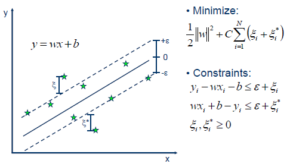

[BACK](./)

<table>
  <tr>
    <th>ID</th><th>Category</th><th>Models</th>
  </tr>
  <tr>
    <td>1</td><td>Regression</td><td>Simple Linear Regression, Multiple Linear Regression, Polynomial Linear Regression, Support Vector Regression, Decision Tree Regression, Random Forest Regression, Ridge Regression, Lasso Regression</td>
  </tr>
  <tr>
    <td>2</td><td>Classification</td><td>Logistic Regression, K Nearest Neighbours, Support Vector Machine, Kernel SVM, Naive Bayes, Decision Tree Classification, Random Forest Classification</td>
  </tr>
  <tr>
    <td>3</td><td>Clustering</td><td>K-Means, Hierarchical Clustering</td>
  </tr>
  <tr>
    <td>4</td><td>Association Rule Learning</td><td>Apriori, Eclat</td>
  </tr>
  <tr>
    <td>5</td><td>Reinforcement Learning</td><td>Upper Confidence Bound, Thompson Sampling</td>
  </tr>
  <tr>
    <td>6</td><td>Natural Language Learning</td><td>Bag of Words</td>
  </tr>
  <tr>
    <td>7</td><td>Deep Learning</td><td>Artificial Neural Network, Convolutional Neural Network, Recurrent Neural Network, Self-Organizing Maps, Boltzmann Machines, AutoEncoders</td>
  </tr>
  <tr>
    <td>8</td><td>Dimensionality Reduction</td><td>Principal Component Analysis, Latent Dirichlet allocation, Kernel PCA</td>
  </tr>
  <tr>
    <td>9</td><td>Boosting</td><td>AdaBoost, Gradient Boosting, XGBoost</td>
  </tr>
</table>

## I. Regression

### 1. Simple Linear Regression

### 2. Multiple Linear Regression

### 3. Polynomial Linear Regression

### 4. Support Vector Regression

### 5. Decision Tree Regression

### 6. Random Forest Regression

### 7. Ridge Regression

### 8. Lasso Regression

## II. Classification

### 1. Logistic Regression

### 2. K Nearest Neighbours

### 3. Support Vector Machine

### 4. Kernel SVM

### 5. Naive Bayes

### 6. Decision Tree Classification

### 7. Random Forest Classification

## III. Clustering

### 1. K-Means

### 2. Hierarchical Clustering

## IV. Association Rule Learning

### 1. Apriori

### 2. Eclat

## V. Reinforcement Learning

### 1. Upper Confidence Bound

### 2. Thompson Sampling

## VI. Natural Language Processing

### 1. Bag of words

## VII. Deep Learning

### 1. Artificial Neural Network

### 2. Convolutional Neural Network

### 3. Recurrenct Neural Network

### 4. Self-Organizing Maps

### 5. Boltzmann Machines

### 6. AutoEncoders

## VIII. Dimensionality Reduction

### 1. Principal Component Analysis

### 2. Latent Dirichlet allocation

### 3. Kernel PCA

## IX. Boosting

### 1. AdaBoost

### 2. Gradient Boosting

### 3. XGBoost

* * *

Reference:

1. [https://www.superdatascience.com/blogs/regression-classification-simple-linear-regression-step-1](https://www.superdatascience.com/blogs/regression-classification-simple-linear-regression-step-1)
1. [https://medium.com/analytics-vidhya/new-aspects-to-consider-while-moving-from-simple-linear-regression-to-multiple-linear-regression-dad06b3449ff](https://medium.com/analytics-vidhya/new-aspects-to-consider-while-moving-from-simple-linear-regression-to-multiple-linear-regression-dad06b3449ff)
1. [https://www.kaggle.com/pankeshpatel/polynomial-linear-regression-tutorial](https://www.kaggle.com/pankeshpatel/polynomial-linear-regression-tutorial)
1. [https://www.nosimpler.me/polynomial-regression/](https://www.nosimpler.me/polynomial-regression/)
1. [https://www.saedsayad.com/support_vector_machine_reg.htm](https://www.saedsayad.com/support_vector_machine_reg.htm)
1. [https://towardsdatascience.com/https-medium-com-lorrli-classification-and-regression-analysis-with-decision-trees-c43cdbc58054](https://towardsdatascience.com/https-medium-com-lorrli-classification-and-regression-analysis-with-decision-trees-c43cdbc58054)
1. [https://towardsdatascience.com/random-forest-and-its-implementation-71824ced454f](https://towardsdatascience.com/random-forest-and-its-implementation-71824ced454f)
1. [https://www.slideshare.net/kaz_yos/visual-explanation-of-ridge-regression-and-lasso](https://www.slideshare.net/kaz_yos/visual-explanation-of-ridge-regression-and-lasso)
1. [https://www.saedsayad.com/logistic_regression.htm](https://www.saedsayad.com/logistic_regression.htm)
1. [https://towardsdatascience.com/knn-k-nearest-neighbors-1-a4707b24bd1d](https://towardsdatascience.com/knn-k-nearest-neighbors-1-a4707b24bd1d)
1. [https://www.saedsayad.com/support_vector_machine.htm](https://www.saedsayad.com/support_vector_machine.htm)
1. [https://stats.stackexchange.com/questions/422902/what-are-kernels-in-support-vector-machine](https://stats.stackexchange.com/questions/422902/what-are-kernels-in-support-vector-machine)
1. [https://www.hackerearth.com/blog/developers/simple-tutorial-svm-parameter-tuning-python-r/](https://www.hackerearth.com/blog/developers/simple-tutorial-svm-parameter-tuning-python-r/)
1. [https://www.globalsoftwaresupport.com/naive-bayes-classifier-explained-step-step/](https://www.globalsoftwaresupport.com/naive-bayes-classifier-explained-step-step/)
1. [https://www.jeremyjordan.me/decision-trees/](https://www.jeremyjordan.me/decision-trees/)
1. [https://medium.com/@williamkoehrsen/random-forest-simple-explanation-377895a60d2d](https://medium.com/@williamkoehrsen/random-forest-simple-explanation-377895a60d2d)
1. [http://sherrytowers.com/2013/10/24/k-means-clustering/](http://sherrytowers.com/2013/10/24/k-means-clustering/)
1. [https://www.displayr.com/what-is-hierarchical-clustering/](https://www.displayr.com/what-is-hierarchical-clustering/)
1. [https://www.sites.google.com/site/getallcodesyouwant/data-mining/apriori-algorithm](https://www.sites.google.com/site/getallcodesyouwant/data-mining/apriori-algorithm)
1. [https://www.slideshare.net/wanaezwani/apriori-and-eclat-algorithm-in-association-rule-mining](https://www.slideshare.net/wanaezwani/apriori-and-eclat-algorithm-in-association-rule-mining)
1. [https://www.geeksforgeeks.org/upper-confidence-bound-algorithm-in-reinforcement-learning/](https://www.geeksforgeeks.org/upper-confidence-bound-algorithm-in-reinforcement-learning/)
1. [https://developpaper.com/a-zthompson-sampling-algorithms-for-machine-learning/](https://developpaper.com/a-zthompson-sampling-algorithms-for-machine-learning/)
1. [https://gdmarmerola.github.io/ts-for-bernoulli-bandit/](https://gdmarmerola.github.io/ts-for-bernoulli-bandit/)
1. [http://prog3.com/sbdm/blog/google19890102/article/details/49359161](http://prog3.com/sbdm/blog/google19890102/article/details/49359161)
1. 
1. 
1. 
1. 
1. 
1. 
1. 
1. 
1. 
1. 
1. 
1. 

[BACK](./)
